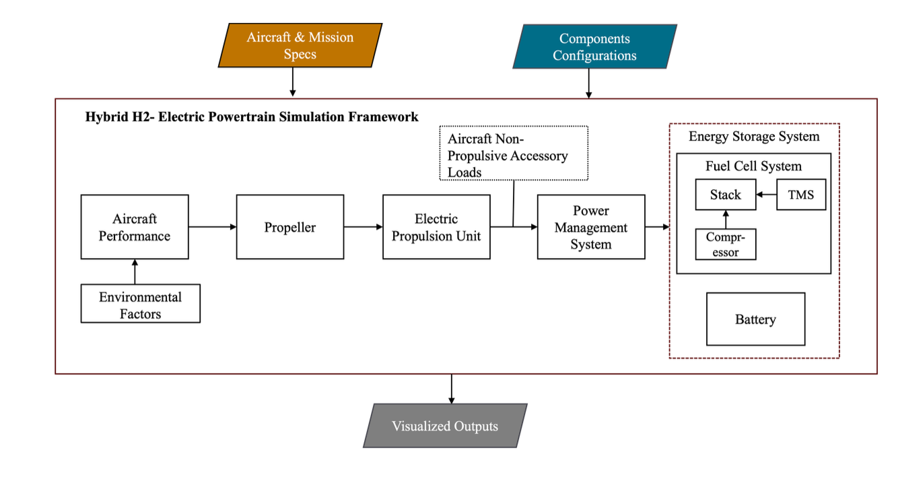
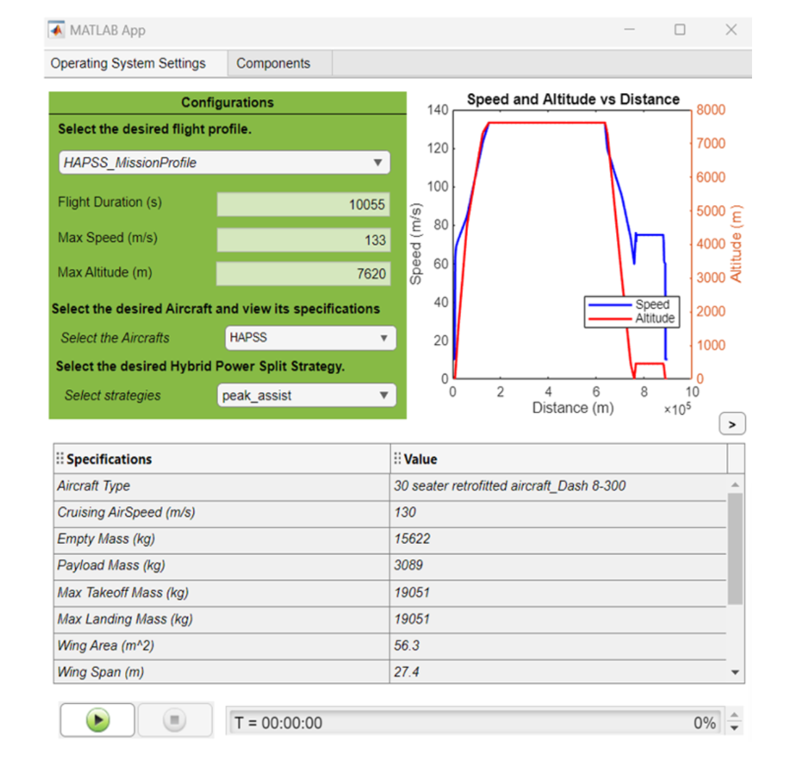

# hydrogen-electric-aircraft-simulator
# Hybrid Hydrogen-Electric Aircraft Powertrain Simulator

## 📌 Overview

This repository presents the development of a **modular, backward-facing simulation framework** for hybrid hydrogen-electric aircraft propulsion systems.

The project was developed as part of an **Engineering Doctorate (EngD) in Automotive Systems Design at TU/e**, contributing to the IOHEVA research initiative.

The simulator enables **mission-level performance analysis**, integrating subsystem models (fuel cell, battery, electric propulsion) with rule-based power management strategies.

---

## 🎯 Objectives

* Develop a **modular simulation framework** for hybrid aircraft propulsion
* Model **fuel cell, battery, and propulsion subsystems**
* Simulate **flight mission phases** (takeoff, climb, cruise, descent, landing)
* Implement **power split strategies** between energy sources
* Validate simulation results against a **reference toolbox**

---

## 🧩 Key Features

* 🔁 Backward-facing modeling approach
* ⚡ Hybrid energy system (Fuel Cell + Battery)
* ✈️ Mission-phase-based simulation
* 🧠 Rule-based Energy Management System (EMS)
* 🖥️ GUI built with MATLAB App Designer
* 📊 Visualization of performance metrics:

  * Thrust
  * Power demand
  * Hydrogen consumption
  * Battery state of charge (SOC)

---

## 🏗️ System Architecture

The simulator follows a **modular architecture**, consisting of:

* Aircraft Model
* Environmental Model
* Electric Propulsion Unit (EPU)
* Fuel Cell System (FCS)
* Battery System
* Energy Management System (EMS)

The framework uses a **backward-facing approach**, where mission requirements determine subsystem power flows.


---

## ⚙️ Modeling Approach

* Physics-based subsystem modeling
* Energy flow consistency enforced
* Time-step simulation of system dynamics
* Modular plug-and-play subsystem integration

---

## 🔋 Hybridization Strategies

The simulator supports multiple power split strategies:

* Fuel Cell Dominant (Peak Assist)
* Fixed Split
* Range Extender
* Fuel Cell Only

---

## 📈 Validation

The model was validated using a **Dash 8-300 reference aircraft**, achieving:

* < 2% error (nRMSE) across key metrics:

  * Thrust
  * Power
  * Hydrogen flow
  * Fuel consumption
---
### 💻 GUI
    

---

## 🧪 Tools & Technologies

* MATLAB
* Simulink
* MATLAB App Designer

---

## 📂 Repository Structure

```
├── docs/           # Documentation & methodology
├── src/            # Source code & subsystem models
├── models/         # Simulink GUI model


---

## ▶️ How to Run

1. Open MATLAB
2. Navigate to project directory
3. Open main Simulink model:

   ```
   src/main.m
   ```
4. Launch GUI and configure:

   * Aircraft parameters
   * Mission profile
   * Power split strategy
   * Components Configuration
5. Run simulation

---

## 🔮 Future Work

* Optimization-based energy management
* Thermal management integration
* Real-time simulation (HiL)


---

## 📜 Disclaimer

This repository is based on academic research conducted at TU/e.
Some data and models may be simplified or excluded due to confidentiality.

---

## 👤 Author

**Lwin Yamon Phyo**
Engineering Doctorate – Automotive Systems Design
Eindhoven University of Technology
